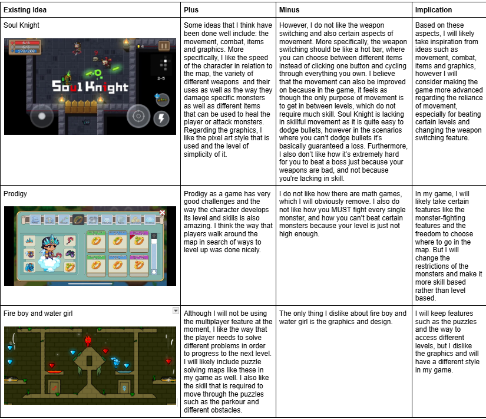
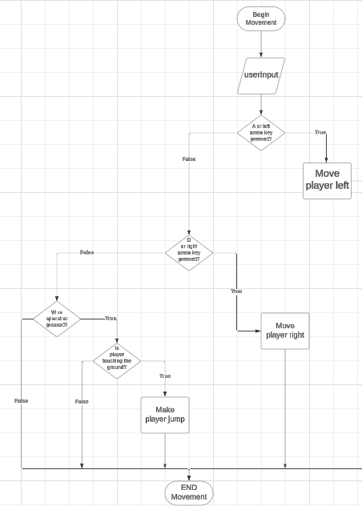
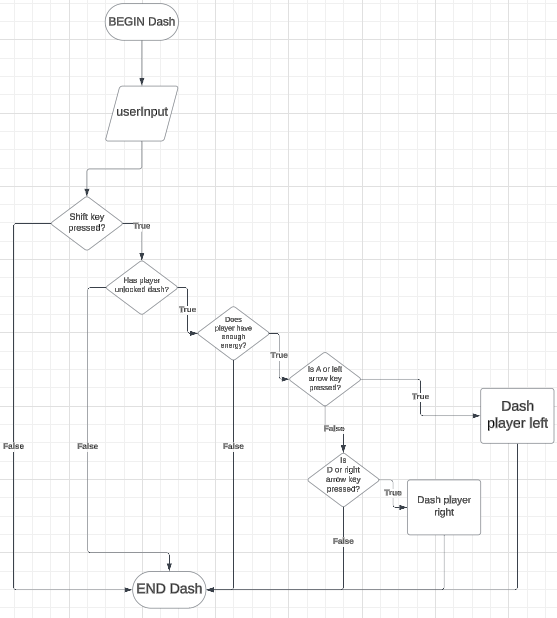
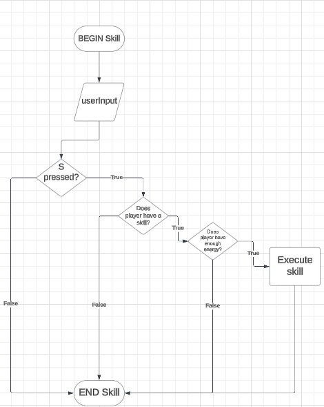
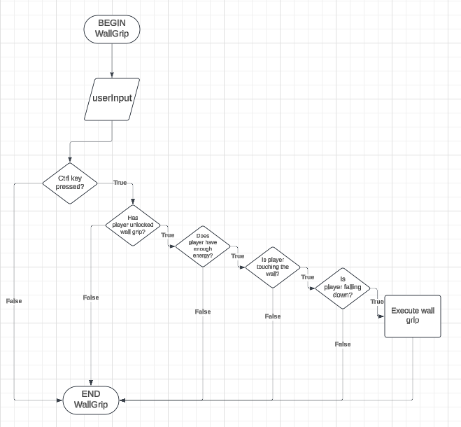
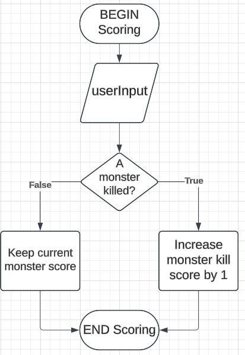
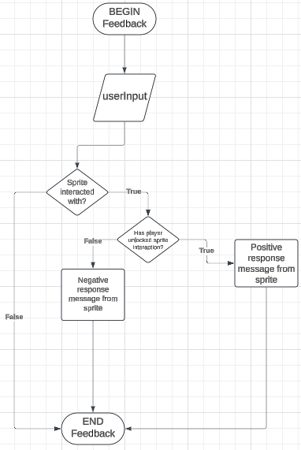
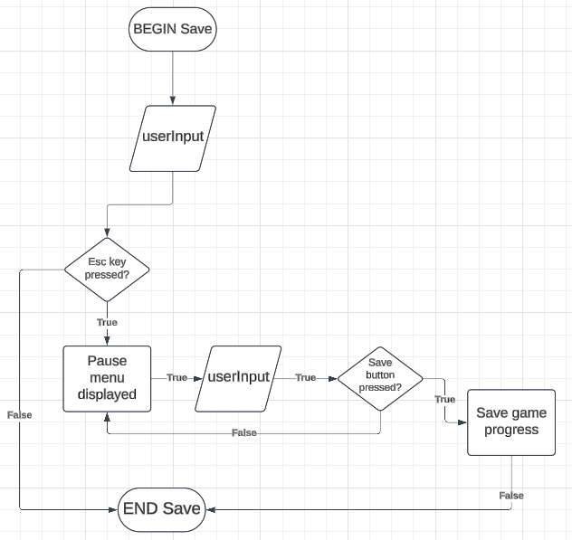
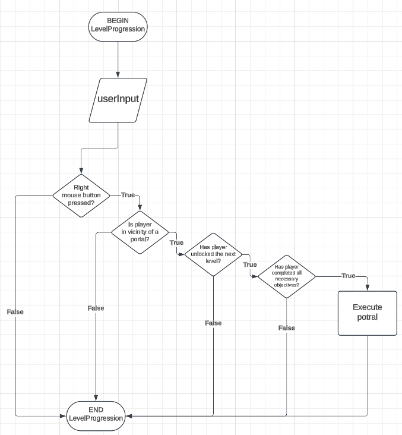

# Assessment Task 3

## **Identifying and Defining** 

**Identifying a need:** Im making a game for kids aged 5 and above that struggle with developing mastery skills without putting in the work. This game is designed to teach kids that you cannot reach a mastery skill or become really good at something without going through the bare basics and many hardships. 

 ***Brainstorming:***

WALL JUMPS?
graphics and storyline kind of inspired by soul knight, but slightly different
include magical weapons and spells 
movements including walking, dash, and then a special skill that you can level up
the objective is to protect this special teleportation device that will send you
after finishing a level or a wave, depending on how hard the level or wave was, gets a timer that will help you prepare for thje next wave, but after you go into a portal, which will take you to another level, then the main timer will pause, and it will be like a platform game

***storyline:***

you have been traveling the stars in search for a habitable planet and you found one. But your starship crashes into the planet. The things that live there are sentient and they want to kill you. There are different waves of different mythical creatures that want you dead. Your spaceship is repairing itself, but all you have is normal earth military equipment to protect yourself, but after you kill some monsters you can make special magical weapons that are better. After you kill all the waves a boss fight comes, and then after you kill the boss, there's a portal that you can go through to get more materials to repair your starship. By going into different portals, it’ll help you unlock different skills. 

**Need:** To improve eye-hand coordination skills in young children aged 5 and above, as well as teaching them about hardships and improving their problem solving skills.

**Problem statement:** Children aged 5 and above are    often kids who find themselves still learning about what they want to achieve in their lifetime. However, as they go on their journey of self discovery, they find themselves struggling to learn new things, especially when hardships come their way. My action-dungeon course game requires players to go through different problems such as fighting monsters, navigating through mazes, protecting objectives and more. This will be done through controlling the character and navigating the game in order to solve different problems, and as they all get harder, the players can use previous knowledge from levels to unlock new levels and solve harder but similar problems, much like in real life. 

**Skill Development:** To develop the skills needed to make the game, I would complete this youtube tutorial: https://www.youtube.com/watch?v=2gABYM5M0ww

### **Requirements Outline:**

**Inputs:**

- My project will require inputs from the player by pressing buttons. Such inputs include: WASD, arrow keys, space bar, shift, ctrl and mouse click buttons.
- For example, user inputs will include directional keyboard keys for character movement, space bar for jump, W for jump, S for skill, shift for dash, crtl to grip on wall, left click mouse button for attack and right click mouse button to interact with items or characters in game. 
 
**Processing:**

- for movement, once inputs have been recieved, the game will check for collisions, calculate the new position of the player and update the game accordingly.
- for combat, once inputs have been recieved, the game will check for a timer, calculate the position of the attack and then execute the attack.

**Outputs:**

- The player will experience outputs such as player character updates, item updates, monster updates, score updates,projectile updates, sound updates, messages and screen updates.
- Example: The game will display player character health, position, stats and sounds, monster health, position, stats and sounds, item updates, game-over message and death sound.

**Transmission:**

- The game will not require online transmission as the data of the game is stored locally.

**Storage:**

- The project will store game progress, user settings and player stats
- Example: The game will store the users game progress, preferred user settings and player stats such as total amount of monsters killed in the game, or the high score (furthest level achieved in game)

### **Functional Requirements**

**User Interaction**

- A and D - move the player left and right. 
    - Pressing on the A key will result in the player moving left. Pressing on the D key will result in the player moving right. 
- Arrow keys (left and right) - move the player left and right
    - Pressing on the left arrow key will result in the player moving left. Pressing on the right arrow key will result in the player moving right. 
- Space bar - jump
    - Pressing on the space bar will result in the player jumping.
- W - jump
    - Pressing on the W key will result in the player jumping.
- S - skill
    - Pressing on S will allow the player to use their skills, which attack in different ways, depending on what skill type it is. 
    -  If the player has a fire skill, it will do better against enemies with an ice tag, and vice versa. 
- Shift - dash
    - Pressing on the Q key will make the player move rapidly in one direction, and for a moment the player will be invincible to any attack, but can only use dash once every 3 seconds.
- Ctrl - wall grip
    - Pressing on Ctrl will allow the player to "grip" on the wall and reduce the speed of falling down when touching a wall
- Left mouse click - attack
    - By clicking on the left mouse button, it will make the player attack the monsters. The speed of which the attack happens can vary depending on what skill you have.
- Right mouse click - interact with items or characters in game. 
    - By clicking on the right moue button, it will allow the player to interact with items or characters in game, such as opening different portals and picking up new items or weapons. 

**Core Gameplay or Simulation Mechanics**

- Game mechanics:
    - Movement 
        1. Movement key is pressed
        2. Game checks for requirements like collisions
        3. Game updates the position of the player
        4. Player moves
    - combat
        1. Left mouse button is pressed
        2. Game checks for requirements like power ups and energy
        3. Attack is executed
        4. Game checks for enemy position
        5. Game updates the monsters stastics 
    - interactions
        1. Game checks for necessary sprites like chests
        2. Game checks for requirements like collisions
        2. Right mouse button is pressed
        2. Game checks for requirements like player stastics
        3. Game updates player statistics and/or position

**Scoring and Feedback**

- Scoring and feedback features include:
    - Score updates, messages and able/unable or locked/unlocked actions or levels.
- Triggers include:
    - Completing a level, killing certain monsters, taking damage, damaging monsters and using an item.

- Scoring features include:
    - Score updates, player statistics (health), monster statistics (healhth), levels.
- Triggers: Killing monsters, taking damage, entering a portal, going to different levels.

- Feedback features include:
    - Messages, locked/unlocked, incorrect actions.
- Triggers: Trying to go to a level that the player hasn't unlocked yet, using an item for the wrong objective, dying.

**Level Progression and Simulation Stages** 

- Players will advance through levels by first defeating all the monsters in the current level, then unlocking the boss fight. After the boss fight, the player will need to find a machine part and then that will unlock a new portal, which takes them to the next level. 

**Saving and Loading Data** 

- The game will save game progress, user settings and player stats. 
- The data will be stored locally on the user's device.

### **Non-Functional Requirements**

**Performance Requiurements**

- The goal is for the game to load in under 3 seconds, and respond to user inputs instantly, having as little lag as possible. 

**Usability Requirements**

- The goal to ensure that the game will be quite easy to navigate without much confusion. 
- The game will be clear and easy to navigate with a beginner-friendly tutorial, including arrows, messages of a back story, and then simulation training to help beginners to learn the game. 

**Compatibility Requirements**

- The game must be compatible on PC and web browsers, as this is a game designed to be controlled using a keyboard.
- However, in order for the game to be compatible on mobile (android and iOS devices) then touch controls will be made for interaction.

**Scalability Requirements**

- As my game grows, certain features will be adapated into my game, such as new weapons, new levels, new storylines and multiple players.

**Security Requirements**

- Once saving the game, you will be able to store your progress in a folder, which you can then encrypt with a password which will ensure privacy.

**Relaibility and Availability**

- The game should be available 99% of the time, with error handling for when the game does seem to randomly crash. If this does happen, then the game will load the last version of the game that has been saved. 

### **Consideration of Social and Ethical Issues**

- **Equity** - the characteristic of fairness.
- **Accessibility** - the characteristic of being easily reachable or obtainable.

**Accessibility** 

My project will be accessible to people of all abilities, as there is no age limit, but the age recomendation is children above the age of 5, as there are some concepts and puzzles that might be difficult for younger children. My project will include accessibility features such as subtitles, alternative controls, visual adjustments and text-to-speech to aid those with disabilites or would prefer to include/change these features to their gameplay. 

**Privacy and Data Protection**

My project will collect user data such as save files, which will record their gameplay. It will only be locally saved on the device.

**Fairness and Representation**

My project will avoid stereotypes and bias, as the game will not contain anything that is targetted at any specific group or organisation, and will avoid harmful stereotypes, due to the game solely based on an astronaut lost in space trying to find his way back to Earth.

**Mental and Emotional Wellbeing**

There is a small chance that my game will slightly affect users mental health, but will not severly impact anyone. The game is design so that the scenes will not be extremely graphic. For example, the death animation for monsters will be just a simple breaking down into an element like fire or ice. 

**Cultural Sensitivities**

There will be no content that is offensive to other cultures and the game will not contain anything to do with race. 

## **PMI Chart**

## **Flow Charts**

**Movement**

**Dash**

**Skill**

**Wall Grip**

**Scoring (monsters killed)**

**Feedback**

**Saving and Loading Data**

**Level Progression (portals)**

## **Pseudocode**

Pseudocode

Movement
INPUT userInput
	IF ‘A’ or ‘left arrow key’ pressed THEN
		Move player left
	ELSE IF ‘D’ or ‘right arrow key’ pressed THEN
		Move player right
	ELSE IF ‘Spacebar’ or ‘W’ pressed THEN
		IF player touching ground THEN
			Player jumps
		ENDIF
	ENDIF
END Movement
Dash
INPUT userInput
	IF ‘shift key’ pressed THEN
		IF player has unlocked dash THEN
			IF player has enough energy THEN
				IF ‘A’ or ‘left arrow key’ pressed THEN
					Dash player left
				ELSE IF ‘D’ or ‘right arrow key’ pressed THEN
					Dash player 
				ENDIF
			ENDIF
		ENDIF
	ENDIF
END Dash

Wall grip
INPUT userInput
	IF ‘ctrl key’ pressed THEN
		IF player has unlocked wall grip THEN
			IF player has enough energy THEN
				IF player is touching wall THEN
					IF player is falling down THEN
						Execute wall grip
					ENDIF
				ENDIF
			ENDIF
		ENDIF
	ENDIF
END WallGrip		
Skill

INPUT userInput
	IF ‘S’ pressed THEN
		IF player has a skill THEN
			IF player has enough energy THEN
				Execute skill
			ENDIF
		ENDIF
	ENDIF
END Skill

Scoring 
INPUT userInput
	IF a monster is killed THEN
		Increase monster skill score by 1
	ELSE keep current monster score
	ENDIF
END Scoring

Feedback
INPUT userInput
	IF player interacted with sprite THEN
		IF player unlocked sprite interaction THEN
			Positive response message from sprite
		ELSE Negative response message from sprite
		ENDIF
	ENDIF
END Feedback

Saving 
INPUT userInput
	IF “esc key’ pressed THEN
		Pause menu displayed
	ELSE IF “save button pressed”
		Save game progress
	ENDIF
END Saving

Level Progression
INPUT userInput
	IF ‘right mouse button’ pressed THEN
		IF player is in vicinity of a portal THEN
			IF player has unlocked the next level THEN
				IF player has completed all necessary objectives THEN
					Execute portal
				ENDIF
			ENDIF
		ENDIF
	ENDIF
END LevelProgression
					
**Storyboards**

submitted on google doc

